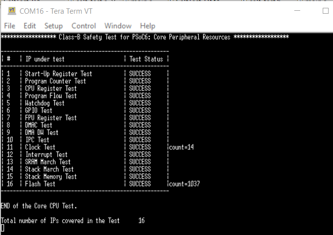

# Class-B Safety Test: Core peripherals

This code example demonstrates the use of class-B Safety Test Library to test the core peripherals of the MCU, which are critical for ensuring safety. The example includes tests such as CPU Registers, Program Counter, WDT, clock, interrupt, IO, DMA, DW, flash (Fletcher's test + CRC test), and config Registers.

The example also evaluates SRAM/Stack using the March test and checks for stack overflow. These tests aim to validate the reliability and robustness of the core peripherals, providing assurance for the safety and dependability of the applications built with the PSoC™ 6 MCU and XMC7000 MCU.

[View this README on GitHub.](https://github.com/Infineon/mtb-example-ce239718-safety-core-test)

[Provide feedback on this code example.](https://cypress.co1.qualtrics.com/jfe/form/SV_1NTns53sK2yiljn?Q_EED=eyJVbmlxdWUgRG9jIElkIjoiQ0UyMzk3MTgiLCJTcGVjIE51bWJlciI6IjAwMi0zOTcxOCIsIkRvYyBUaXRsZSI6IkNsYXNzLUIgU2FmZXR5IFRlc3Q6IENvcmUgcGVyaXBoZXJhbHMiLCJyaWQiOiJzZGFrIiwiRG9jIHZlcnNpb24iOiIyLjAuMCIsIkRvYyBMYW5ndWFnZSI6IkVuZ2xpc2giLCJEb2MgRGl2aXNpb24iOiJNQ0QiLCJEb2MgQlUiOiJJQ1ciLCJEb2MgRmFtaWx5IjoiUFNPQyJ9)


## Requirements

- [ModusToolbox&trade;](https://www.infineon.com/modustoolbox) v3.2 or later (tested with v3.2)
- Board support package (BSP) minimum required version: v4.2.0
- Programming language: C
- Associated parts: [PSoC&trade; 6 MCU](https://www.infineon.com/cms/en/product/microcontroller/32-bit-psoc-arm-cortex-microcontroller/psoc-6-32-bit-arm-cortex-m4-mcu), [XMC7000 MCU](https://www.infineon.com/cms/en/product/microcontroller/32-bit-industrial-microcontroller-based-on-arm-cortex-m)


## Supported toolchains (make variable 'TOOLCHAIN')

- GNU Arm&reg; Embedded Compiler v11.3.1 (`GCC_ARM`) – Default value of `TOOLCHAIN`


## Supported kits (make variable 'TARGET')

- [PSoC&trade; 62S2 Wi-Fi Bluetooth&reg; Prototyping Kit](https://www.infineon.com/CY8CPROTO-062S2-43439) (`CY8CPROTO-062S2-43439`) – Default value of `TARGET`
- [PSoC&trade; 6 Wi-Fi Bluetooth&reg; Prototyping Kit](https://www.infineon.com/CY8CPROTO-062-4343W) (`CY8CPROTO-062-4343W`)
- [PSoC&trade; 6 Wi-Fi Bluetooth&reg; Pioneer Kit](https://www.infineon.com/CY8CKIT-062-WIFI-BT) (`CY8CKIT-062-WIFI-BT`)
- [PSoC&trade; 6 Bluetooth&reg; LE Pioneer Kit](https://www.infineon.com/CY8CKIT-062-BLE) (`CY8CKIT-062-BLE`)
- [PSoC&trade; 6 Bluetooth&reg; LE Prototyping Kit](https://www.infineon.com/CY8CPROTO-063-BLE) (`CY8CPROTO-063-BLE`)
- [PSoC&trade; 62S2 Wi-Fi Bluetooth&reg; Pioneer Kit](https://www.infineon.com/CY8CKIT-062S2-43012) (`CY8CKIT-062S2-43012`)
- [PSoC&trade; 62S1 Wi-Fi Bluetooth&reg; Pioneer Kit](https://www.infineon.com/CYW9P62S1-43438EVB-01) (`CYW9P62S1-43438EVB-01`)
- [PSoC&trade; 62S1 Wi-Fi Bluetooth&reg; Pioneer Kit](https://www.infineon.com/CYW9P62S1-43012EVB-01) (`CYW9P62S1-43012EVB-01`)
- [PSoC&trade; 64 "Secure Boot" Wi-Fi Bluetooth&reg; Pioneer Kit](https://www.infineon.com/CY8CKIT-064B0S2-4343W) (`CY8CKIT-064B0S2-4343W`)
- [PSoC&trade; 62S4 Pioneer Kit](https://www.infineon.com/CY8CKIT-062S4) (`CY8CKIT-062S4`)
- [PSoC&trade; 62S2 Evaluation Kit](https://www.infineon.com/CY8CEVAL-062S2) (`CY8CEVAL-062S2`, `CY8CEVAL-062S2-LAI-4373M2`, `CY8CEVAL-062S2-MUR-43439M2`, `CY8CEVAL-062S2-LAI-43439M2`, `CY8CEVAL-062S2-MUR-4373EM2`, `CY8CEVAL-062S2-MUR-4373M2`,`CY8CEVAL-062S2-CYW43022CUB`)
- [XMC7200 Evaluation Kit](https://www.infineon.com/KIT_XMC72_EVK) (`KIT_XMC72_EVK`, `KIT_XMC72_EVK_MUR_43439M2`)
- [PSoC&trade; 62S3 Wi-Fi Bluetooth&reg; Prototyping Kit](https://www.infineon.com/CY8CPROTO-062S3-4343W) (`CY8CPROTO-062S3-4343W`)
- [XMC7100 Evaluation Kit](https://www.infineon.com/KIT_XMC71_EVK_LITE_V1) (`KIT_XMC71_EVK_LITE_V1`)


## Hardware setup

This example uses the board's default configuration. See the kit user guide to ensure that the board is configured correctly.

> **Note:** The PSoC&trade; 6 Bluetooth&reg; LE Pioneer Kit (CY8CKIT-062-BLE) and the PSoC&trade; 6 Wi-Fi Bluetooth&reg; Pioneer Kit (CY8CKIT-062-WIFI-BT) ship with KitProg2 installed. ModusToolbox&trade; requires KitProg3. Before using this code example, make sure that the board is upgraded to KitProg3. The tool and instructions are available in the [Firmware Loader](https://github.com/Infineon/Firmware-loader) GitHub repository. If you do not upgrade, you will see an error like "unable to find CMSIS-DAP device" or "KitProg firmware is out of date".

## Software setup

See the [ModusToolbox&trade; tools package installation guide](https://www.infineon.com/ModusToolboxInstallguide) for information about installing and configuring the tools package.

Install a terminal emulator if you don't have one. Instructions in this document use [Tera Term](https://teratermproject.github.io/index-en.html).

This example requires no additional software or tools.


## Using the code example

### Create the project

The ModusToolbox&trade; tools package provides the Project Creator as both a GUI tool and a command line tool.

<details><summary><b>Use Project Creator GUI</b></summary>

1. Open the Project Creator GUI tool.

   There are several ways to do this, including launching it from the dashboard or from inside the Eclipse IDE. For more details, see the [Project Creator user guide](https://www.infineon.com/ModusToolboxProjectCreator) (locally available at *{ModusToolbox&trade; install directory}/tools_{version}/project-creator/docs/project-creator.pdf*).

2. On the **Choose Board Support Package (BSP)** page, select a kit supported by this code example. See [Supported kits](#supported-kits-make-variable-target).

   > **Note:** To use this code example for a kit not listed here, you may need to update the source files. If the kit does not have the required resources, the application may not work.

3. On the **Select Application** page:

   a. Select the **Applications(s) Root Path** and the **Target IDE**.

   > **Note:** Depending on how you open the Project Creator tool, these fields may be pre-selected for you.

   b.	Select this code example from the list by enabling its check box.

   > **Note:** You can narrow the list of displayed examples by typing in the filter box.

   c. (Optional) Change the suggested **New Application Name** and **New BSP Name**.

   d. Click **Create** to complete the application creation process.

</details>

<details><summary><b>Use Project Creator CLI</b></summary>

The 'project-creator-cli' tool can be used to create applications from a CLI terminal or from within batch files or shell scripts. This tool is available in the *{ModusToolbox&trade; install directory}/tools_{version}/project-creator/* directory.

Use a CLI terminal to invoke the 'project-creator-cli' tool. On Windows, use the command-line 'modus-shell' program provided in the ModusToolbox&trade; installation instead of a standard Windows command-line application. This shell provides access to all ModusToolbox&trade; tools. You can access it by typing "modus-shell" in the search box in the Windows menu. In Linux and macOS, you can use any terminal application.

The following example clones the "[Core peripherals test](https://github.com/Infineon/mtb-example-ce239718-safety-core-test)" application with the desired name "Core_Test" configured for the *CY8CPROTO-062-4343W* BSP into the specified working directory *C:/mtb_projects*:

   ```
   project-creator-cli --board-id CY8CPROTO-062-4343W --app-id mtb-example-ce239718-safety-core-test --user-app-name Core_Test --target-dir "C:/mtb_projects"
   ```


The 'project-creator-cli' tool has the following arguments:

Argument | Description | Required/optional
---------|-------------|-----------
`--board-id` | Defined in the <id> field of the [BSP](https://github.com/Infineon?q=bsp-manifest&type=&language=&sort=) manifest | Required
`--app-id`   | Defined in the <id> field of the [CE](https://github.com/Infineon?q=ce-manifest&type=&language=&sort=) manifest | Required
`--target-dir`| Specify the directory in which the application is to be created if you prefer not to use the default current working directory | Optional
`--user-app-name`| Specify the name of the application if you prefer to have a name other than the example's default name | Optional

> **Note:** The project-creator-cli tool uses the `git clone` and `make getlibs` commands to fetch the repository and import the required libraries. For details, see the "Project creator tools" section of the [ModusToolbox&trade; tools package user guide](https://www.infineon.com/ModusToolboxUserGuide) (locally available at {ModusToolbox&trade; install directory}/docs_{version}/mtb_user_guide.pdf).

</details>


### Open the project

After the project has been created, you can open it in your preferred development environment.


<details><summary><b>Eclipse IDE</b></summary>

If you opened the Project Creator tool from the included Eclipse IDE, the project will open in Eclipse automatically.

For more details, see the [Eclipse IDE for ModusToolbox&trade; user guide](https://www.infineon.com/MTBEclipseIDEUserGuide) (locally available at *{ModusToolbox&trade; install directory}/docs_{version}/mt_ide_user_guide.pdf*).

</details>


<details><summary><b>Visual Studio (VS) Code</b></summary>

Launch VS Code manually, and then open the generated *{project-name}.code-workspace* file located in the project directory.

For more details, see the [Visual Studio Code for ModusToolbox&trade; user guide](https://www.infineon.com/MTBVSCodeUserGuide) (locally available at *{ModusToolbox&trade; install directory}/docs_{version}/mt_vscode_user_guide.pdf*).

</details>

<details><summary><b>Command line</b></summary>

If you prefer to use the CLI, open the appropriate terminal, and navigate to the project directory. On Windows, use the command-line 'modus-shell' program; on Linux and macOS, you can use any terminal application. From there, you can run various `make` commands.

For more details, see the [ModusToolbox&trade; tools package user guide](https://www.infineon.com/ModusToolboxUserGuide) (locally available at *{ModusToolbox&trade; install directory}/docs_{version}/mtb_user_guide.pdf*).

</details>


## Operation

If using a PSoC&trade; 64 "Secure" MCU kit (like CY8CKIT-064B0S2-4343W), the PSoC&trade; 64 device must be provisioned with keys and policies before being programmed. Follow the instructions in the ["Secure Boot" SDK user guide](https://www.infineon.com/dgdlac/Infineon-PSoC_64_Secure_MCU_Secure_Boot_SDK_User_Guide-Software-v07_00-EN.pdf?fileId=8ac78c8c7d0d8da4017d0f8c361a7666) to provision the device. If the kit is already provisioned, copy-paste the keys and policy folder to the application folder.

1. Connect the board to your PC using the provided USB cable through the KitProg3 USB connector.

2. Open a terminal program and select the KitProg3 COM port. Set the serial port parameters to 8N1 and 115200 baud.

3. Program the board using one of the following:

   <details><summary><b>Using Eclipse IDE</b></summary>

      1. Select the application project in the Project Explorer.

      2. In the **Quick Panel**, scroll down, and click **\<Application Name> Program (KitProg3_MiniProg4)**.
   </details>


   <details><summary><b>In other IDEs</b></summary>

   Follow the instructions in your preferred IDE.
   </details>


   <details><summary><b>Using CLI</b></summary>

     From the terminal, execute the `make program` command to build and program the application using the default toolchain to the default target. The default toolchain is specified in the application's Makefile but you can override this value manually:
      ```
      make program TOOLCHAIN=<toolchain>
      ```

      Example:
      ```
      make program TOOLCHAIN=GCC_ARM
      ```
   </details>

4. After programming, the application starts automatically. Confirm that **Class-B Safety Test for PSoC6: Core Peripheral Resources** is displayed on the UART terminal.

5. The serial terminal should display the result of all the tests covered in this example.
   **Figure 1. Terminal output on program startup**

   

> **Note:** For the flash test to pass, it is recommended to copy and paste the checksum printed on the teraterm to `flash_StoredCheckSum` variable in the *self_est_.c* file for respective kits.

## Debugging


You can debug the example to step through the code.


<details><summary><b>In Eclipse IDE</b></summary>

Use the **\<Application Name> Debug (KitProg3_MiniProg4)** configuration in the **Quick Panel**. For details, see the "Program and debug" section in the [Eclipse IDE for ModusToolbox&trade; user guide](https://www.infineon.com/MTBEclipseIDEUserGuide).

> **Note:** **(Only while debugging)** On the CM4 CPU, some code in `main()` may execute before the debugger halts at the beginning of `main()`. This means that some code executes twice – once before the debugger stops execution, and again after the debugger resets the program counter to the beginning of `main()`. See [KBA231071](https://community.infineon.com/docs/DOC-21143) to learn about this and for the workaround.

</details>


<details><summary><b>In other IDEs</b></summary>

Follow the instructions in your preferred IDE.
</details>


## Design and implementation

This example utilizes the internal core resources of the PSoC&trade; 6 MCU to conduct comprehensive testing. The *design.modus* file typically requires minimal configuration changes, except for specific timer resources needed for the interrupt and clock tests, which can be configured in the *design.modus* file using the device configurator.

The example begins by initializing the BSP configuration and setting up the retarget-io for debug prints. A series of tests are then performed to evaluate crucial components. These include tests on Program Counter (PC), CPU Registers, Watchdog Timer (WDT), clock functionality, and interrupt handling. The test results are displayed on the console, aiding in monitoring and troubleshooting.

The example further focuses on verifying the integrity of the flash memory by comparing stored checksums with calculated checksums based on flash data. Additionally, tests are conducted on IO functionality. Startup Config Registers are saved to flash and March tests are performed on SRAM and Stack using SelfTest APIs to ensure their proper functioning.

To ensure system stability, the example continually checks for stack overflow and verifies the Startup Config Register values by comparing them with stored values.

By executing these tests, the example ensures the proper functioning of the core peripherals, providing valuable insights into the performance and reliability of the PSoC&trade; 6 MCU. The test results are displayed on the console, facilitating easy evaluation and troubleshooting.


### Resources and settings

**Table 1. Application resources**

 Resource  |  Alias/object     |    Purpose
 :-------- | :-------------    | :------------
 UART (HAL)| CYBSP_DEBUG_UART| UART HAL object used by Retarget-IO for the Debug UART port
 Counter (PDL)   | CYBSP_CLOCK_TEST_TIMER   | Counter used for measuring clock with reference clock
 Counter (PDL)    | CYBSP_TIMER     | Counter used to measure number of interrupts within a period
 Data Wire (PDL)    | DMA_DW     | Data wire object used to test data wire functionality

<br>

## Summary of the test details

#### 1. Program Counter test:
The Program Counter test involves jumping to known addresses of functions, updating global variables from that function, and then verifying the value of the global variable to check whether that function was executed or not. Custom linker scripts are used to place the functions to known addresses.

#### 2. CPU Registers test:
The CPU Registers test verifies the integrity of CPU Registers by writing different patterns of values into them and then reading them back to ensure that every bit is correct.

#### 3. WDT test:
To perform the Watchdog Timer (WDT) test, enable the WDT and execute an infinite loop. If the WDT is functioning properly, it generates a reset. After the reset, the function checks the source of the reset. If the WDT is the source of the reset, the function returns with a success status. If the reset was caused by something other than the WDT, the function returns with an error status.

#### 4. Clock test:
The Clock test implements the independent time slot monitoring described in section H.2.18.10.4 of the IEC 60730 standard. Its purpose is to verify the reliability of the IMO system clock by ensuring that it runs neither too fast nor too slow within the tolerance, which is achieved by comparing counters with an independent clock source. The tolerance values are configurable.

#### 5. Flash test (invariable memory):
The flash test offers two types of tests which can be selected using `FLASH_TEST_MODE` macro from *SelfTest_Flash.h* file: 
- Fletcher's checksum
- CRC32 checksum verification

Both tests involve comparing the precalculated checksum with the actual checksum calculated from the data. Both, the precalculated checksum and the checksum data are stored in the flash. Custom linker scripts are used to store the precalculated checksum at the appropriate location in the flash.

To use the test, the user needs to update the precalculated checksum in the `flash_StoredCheckSum` variable in the *self_est_.c* file whenever there is a change in the application source binary. Hence, it is recommended to copy and paste the checksum printed on the teraterm to `flash_StoredCheckSum` variable in the *self_est_.c* file, which is a source file. During the test, the actual checksum is calculated based on the data stored inside the flash. Hence, it is recommended to erase the entire flash before programming it so that the actual checksum calculated during the test does not mismatch.

#### 6. Interrupt test:
The Interrupt test implements the independent time-slot monitoring defined in section H.2.18.10.4 of the IEC 60730 standard. It verifies that the number of interrupts that occurred is within a predefined range and also checks whether interrupts occur regularly. The test uses the interrupt source driven by the timer and checks the interrupt controller.

#### 7. IO test:
The IO test provides a maskable test for all available ports and pins on the device. The goal of the test is to ensure that pins are not shorted to VCC or GND. 

To detect a pin-to-ground short, the pin is configured in the resistive pull-up drive mode. Under normal conditions, the CPU reads a logical one because of the pull-up resistor. If the pin is connected to the ground through a small resistance, the input level is recognized as a logical '0'.

To detect a pin-to-VCC short, the pin is configured in the resistive pull-down drive mode. The input level is usually '0', but will read as a logical '1' if the pin is shorted to VCC.

#### 8. Config Registers test:
This test checks the Configuration Registers for digital clocks, analog settings, GPIO, and HSIOM. Two types of tests can be selected using `STARTUP_CFG_REGS_MODE` macro from *SelfTest_ConfigRegisters.h* file:

- CFG_REGS_TO_FLASH_MODE: Duplicates of the Startup Config Registers are stored in the flash memory after device startup. The Config Registers are periodically compared to the stored duplicates. If any Registers are corrupted, they can be restored from the flash.

- CFG_REGS_CRC_MODE: The calculated CRC is compared to the CRC previously stored in flash when the CRC status semaphore is set. If the status semaphore is not set, the CRC must be calculated and stored in the flash and the status semaphore must be set.

#### 9. SRAM/Stack March test (variable memory):
The SRAM/Stack March test is used to verify the integrity of the SRAM and stack memory of the device. The test is performed by writing a known data sequence to the memory, and then reading it back and verifying that the data is not corrupted. This process is repeated with different patterns and memory locations to ensure that the memory is thoroughly tested.

The test covers the data and the block starting symbol (bss) sections of the RAM, the heap section, and the stack area. A temporary buffer is used to hold data during the testing process.

#### 10. Stack overflow test (variable memory):
The purpose of the stack overflow test is to verify that the stack does not overlap with the program or data memory during program execution. One common cause of this issue is the use of recursive functions.

In this test, a fixed pattern is used to fill a block of memory below the stack and periodic checks are performed to detect any corruption. It verifies the stored test pattern within a specific area of the stack, typically located at the end where the stack grows.

By periodically checking for corruption, the test ensures the integrity of the stored pattern and confirms proper stack operation. This helps prevent potential stack overflow issues and ensures system stability.

#### 11. FPU Registers test:
The FPU registers test detects stuck-at faults in the FPU by using the checkerboard test. This test ensures that the bits in the registers are not stuck at value '0' or '1'. 
The registers are tested by performing a write/read/compare test sequence using a checkerboard pattern (0x5555 5555, then 0xaaaa aaaaa). These binary sequences are valid floating point values. The test returns an error code if the returned values do not match.

#### 12. Program Flow test:
A specific method is used to check program execution flow. For every critical execution code block, unique numbers are added to or subtracted from complementary counters before block execution and immediately after execution. These procedures allow you to see if the code block is correctly called from the main program flow and to check if the block is correctly executed. As long as there are always the same number of exit and entry points, the counter pair will always be complementary after each tested block. Any unexpected values should be treated as a program flow execution error. 

#### 13. IPC (Inter-Process Communication / Inter-Processor Communication) test:
The IPC block is tested for multi core MCUs and is tested using the Cy_IPC_Pipe wrapper functions. An IPC callback function is registered first, so that callback gets called i.e. the test succeeds, when a message is sent to the pipe using IPC_Pipe_SendMessage. If the callback is not called after SendMessage, the test fails.
 
#### 14. DMA / DW test:
The DataWire blocks are tested using the following procedure:
   1. A destination block of size 64 bytes is set to 0 with DW transfers using 16 x 32-bit transfers from a fixed address.
   2. The destination block is verified to be all 0.
   3. The same destination block is filled with 00 00 ff by using an 8-bit DMA from a fixed address with an increment of 3 and a length of 22 (64+(3-1))/3.
   4. The destination block is verified to contain the correct pattern (shown below with lowest address first):
         ```
      ff0000ff0000ff0000ff0000ff0000ff0000ff0000ff0000…
      ```


## Related resources

Resources  | Links
-----------|----------------------------------
Application notes  | [AN228571](https://www.infineon.com/AN228571) - Getting started with PSoC&trade; 6 MCU on ModusToolbox&trade; <br>[AN234334](https://www.infineon.com/dgdl/Infineon-AN234334_Getting_started_with_XMC7000_MCU_on_ModusToolbox_software-ApplicationNotes-v01_00-EN.pdf?fileId=8ac78c8c8412f8d301842d32c5765bfd) – Getting started with XMC7000 MCU on ModusToolbox&trade; 
Code examples  | [Using ModusToolbox&trade;](https://github.com/Infineon/Code-Examples-for-ModusToolbox-Software) on GitHub
Device documentation | [PSoC&trade; 6 MCU datasheets](https://documentation.infineon.com/html/psoc6/bnm1651211483724.html) <br> [PSoC&trade; 6 technical reference manuals](https://documentation.infineon.com/html/psoc6/zrs1651212645947.html)<br>[XMC7000 MCU datasheets](https://www.infineon.com/cms/en/product/microcontroller/32-bit-industrial-microcontroller-based-on-arm-cortex-m/) <br> [XMC7000 technical reference manuals](https://www.infineon.com/cms/en/product/microcontroller/32-bit-industrial-microcontroller-based-on-arm-cortex-m/)
Development kits | Select your kits from the [Evaluation board finder](https://www.infineon.com/cms/en/design-support/finder-selection-tools/product-finder/evaluation-board).
Libraries on GitHub  | [mtb-pdl-cat1](https://github.com/Infineon/mtb-pdl-cat1) – PSoC&trade; 6 Peripheral Driver Library (PDL)  <br> [mtb-hal-cat1](https://github.com/Infineon/mtb-hal-cat1) – Hardware Abstraction Layer (HAL) library
Middleware on GitHub | [capsense](https://github.com/Infineon/capsense) - CAPSENSE&trade; library and documents <br> [mtb-stl](https://github.com/Infineon/mtb-stl) - Safety Test Library (STL)
Tools  | [ModusToolbox&trade;](https://www.infineon.com/modustoolbox) – ModusToolbox&trade; software is a collection of easy-to-use libraries and tools enabling rapid development with Infineon MCUs for applications ranging from wireless and cloud-connected systems, edge AI/ML, embedded sense and control, to wired USB connectivity using PSoC&trade; Industrial/IoT MCUs, AIROC&trade; Wi-Fi and Bluetooth&reg; connectivity devices, XMC&trade; Industrial MCUs, and EZ-USB&trade;/EZ-PD&trade; wired connectivity controllers. ModusToolbox&trade; incorporates a comprehensive set of BSPs, HAL, libraries, configuration tools, and provides support for industry-standard IDEs to fast-track your embedded application development.

<br>


## Other resources

Infineon provides a wealth of data at [www.infineon.com](https://www.infineon.com) to help you select the right device, and quickly and effectively integrate it into your design.


## Document history

Document title: *CE239718* - *Class-B safety test: Core peripherals*

 Version | Description of change
 ------- | ---------------------
 1.0.0   | New code example
 2.0.0   | Updated to add new BSPs and IPs

<br>

All referenced product or service names and trademarks are the property of their respective owners.

The Bluetooth&reg; word mark and logos are registered trademarks owned by Bluetooth SIG, Inc., and any use of such marks by Infineon is under license.


---------------------------------------------------------

© Cypress Semiconductor Corporation, 2024. This document is the property of Cypress Semiconductor Corporation, an Infineon Technologies company, and its affiliates ("Cypress").  This document, including any software or firmware included or referenced in this document ("Software"), is owned by Cypress under the intellectual property laws and treaties of the United States and other countries worldwide.  Cypress reserves all rights under such laws and treaties and does not, except as specifically stated in this paragraph, grant any license under its patents, copyrights, trademarks, or other intellectual property rights.  If the Software is not accompanied by a license agreement and you do not otherwise have a written agreement with Cypress governing the use of the Software, then Cypress hereby grants you a personal, non-exclusive, nontransferable license (without the right to sublicense) (1) under its copyright rights in the Software (a) for Software provided in source code form, to modify and reproduce the Software solely for use with Cypress hardware products, only internally within your organization, and (b) to distribute the Software in binary code form externally to end users (either directly or indirectly through resellers and distributors), solely for use on Cypress hardware product units, and (2) under those claims of Cypress's patents that are infringed by the Software (as provided by Cypress, unmodified) to make, use, distribute, and import the Software solely for use with Cypress hardware products.  Any other use, reproduction, modification, translation, or compilation of the Software is prohibited.
<br>
TO THE EXTENT PERMITTED BY APPLICABLE LAW, CYPRESS MAKES NO WARRANTY OF ANY KIND, EXPRESS OR IMPLIED, WITH REGARD TO THIS DOCUMENT OR ANY SOFTWARE OR ACCOMPANYING HARDWARE, INCLUDING, BUT NOT LIMITED TO, THE IMPLIED WARRANTIES OF MERCHANTABILITY AND FITNESS FOR A PARTICULAR PURPOSE.  No computing device can be absolutely secure.  Therefore, despite security measures implemented in Cypress hardware or software products, Cypress shall have no liability arising out of any security breach, such as unauthorized access to or use of a Cypress product. CYPRESS DOES NOT REPRESENT, WARRANT, OR GUARANTEE THAT CYPRESS PRODUCTS, OR SYSTEMS CREATED USING CYPRESS PRODUCTS, WILL BE FREE FROM CORRUPTION, ATTACK, VIRUSES, INTERFERENCE, HACKING, DATA LOSS OR THEFT, OR OTHER SECURITY INTRUSION (collectively, "Security Breach").  Cypress disclaims any liability relating to any Security Breach, and you shall and hereby do release Cypress from any claim, damage, or other liability arising from any Security Breach.  In addition, the products described in these materials may contain design defects or errors known as errata which may cause the product to deviate from published specifications. To the extent permitted by applicable law, Cypress reserves the right to make changes to this document without further notice. Cypress does not assume any liability arising out of the application or use of any product or circuit described in this document. Any information provided in this document, including any sample design information or programming code, is provided only for reference purposes.  It is the responsibility of the user of this document to properly design, program, and test the functionality and safety of any application made of this information and any resulting product.  "High-Risk Device" means any device or system whose failure could cause personal injury, death, or property damage.  Examples of High-Risk Devices are weapons, nuclear installations, surgical implants, and other medical devices.  "Critical Component" means any component of a High-Risk Device whose failure to perform can be reasonably expected to cause, directly or indirectly, the failure of the High-Risk Device, or to affect its safety or effectiveness.  Cypress is not liable, in whole or in part, and you shall and hereby do release Cypress from any claim, damage, or other liability arising from any use of a Cypress product as a Critical Component in a High-Risk Device. You shall indemnify and hold Cypress, including its affiliates, and its directors, officers, employees, agents, distributors, and assigns harmless from and against all claims, costs, damages, and expenses, arising out of any claim, including claims for product liability, personal injury or death, or property damage arising from any use of a Cypress product as a Critical Component in a High-Risk Device. Cypress products are not intended or authorized for use as a Critical Component in any High-Risk Device except to the limited extent that (i) Cypress's published data sheet for the product explicitly states Cypress has qualified the product for use in a specific High-Risk Device, or (ii) Cypress has given you advance written authorization to use the product as a Critical Component in the specific High-Risk Device and you have signed a separate indemnification agreement.
<br>
Cypress, the Cypress logo, and combinations thereof, ModusToolbox, PSoC, CAPSENSE, EZ-USB, F-RAM, and TRAVEO are trademarks or registered trademarks of Cypress or a subsidiary of Cypress in the United States or in other countries. For a more complete list of Cypress trademarks, visit www.infineon.com. Other names and brands may be claimed as property of their respective owners.
